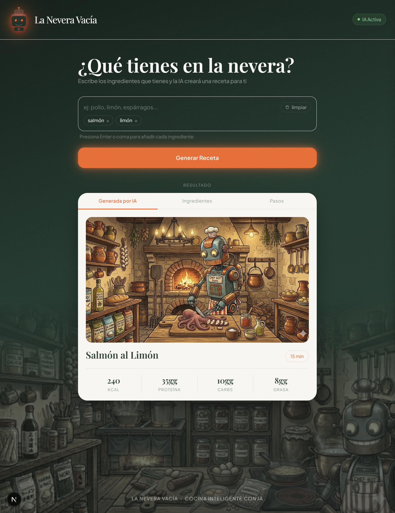
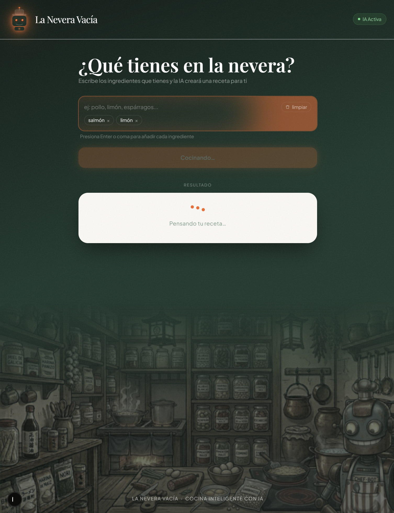
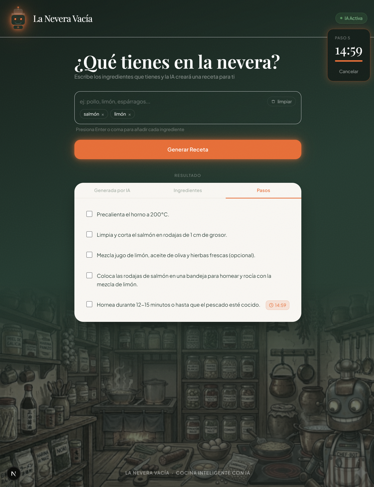

# 🥕 La Nevera Vacía

**La Nevera Vacía** es una aplicación web que genera recetas personalizadas a partir de los ingredientes que tienes en casa, usando inteligencia artificial local con Ollama.

---

## ¿Qué hace?

1. Escribes los ingredientes que tienes disponibles
2. La IA genera una receta completa con título, pasos, tiempo de preparación e información nutricional
3. Se muestra una imagen del plato generada aleatoriamente
4. Puedes seguir los pasos con checkboxes y activar un cronómetro para los tiempos de cocción

---

## Capturas de pantalla





---

## Tecnologías

| Tecnología | Uso |
|---|---|
| [Next.js 15](https://nextjs.org/) | Framework fullstack (App Router) |
| [Vercel AI SDK](https://sdk.vercel.ai/) | Integración con modelos de IA |
| [Ollama](https://ollama.com/) | Modelo de IA corriendo en local |
| [llama3.2](https://ollama.com/library/llama3.2) | Modelo de lenguaje para generar recetas |
| [Tailwind CSS](https://tailwindcss.com/) | Estilos |
| [TypeScript](https://www.typescriptlang.org/) | Tipado estático |

---

## Requisitos previos

- [Node.js](https://nodejs.org/) 18 o superior
- [Ollama](https://ollama.com/) instalado y ejecutándose en local

---

## Instalación

### 1. Clona el repositorio

```bash
git clone https://github.com/tu-usuario/laneveravacia.git
cd laneveravacia
```

### 2. Instala las dependencias

```bash
npm install
```

### 3. Descarga el modelo de IA

```bash
ollama pull llama3.2
```

### 4. Inicia Ollama

```bash
ollama serve
```

### 5. Arranca el servidor de desarrollo

```bash
npm run dev
```

Abrí [http://localhost:3000](http://localhost:3000) en el navegador.

---

## Estructura del proyecto

```
src/
├── app/
│   ├── actions.ts          # Server Action — lógica de IA con Vercel AI SDK
│   ├── page.tsx            # Interfaz principal
│   ├── layout.tsx          # Maqueta base, fuentes y metadatos
│   ├── globals.css         # Estilos globales y animaciones
│   └── api/
│       └── image/
│           └── route.ts    # Endpoint para servir imágenes aleatorias
public/
└── images/                 # Imágenes de platos (añade las tuyas aquí)
```

---

## Vercel AI SDK

[Vercel AI SDK](https://sdk.vercel.ai/) es una librería de JavaScript/TypeScript que permite conectar tu aplicación web con modelos de IA de forma sencilla y unificada.

**Sin ella**, para hablar con un modelo de IA tendrías que hacer peticiones HTTP manuales, gestionar los formatos específicos de cada proveedor por separado y manejar toda la lógica de streaming tú mismo — mucho más engorroso y difícil de mantener.

**Con ella**, escribes una sola API independiente del proveedor. Hoy usas Ollama en local, mañana cambias a OpenAI o Anthropic modificando una única línea de código.

### Funciones principales que vale la pena explorar

| Función | Descripción |
|---|---|
| `generateText` | Envía un prompt y devuelve texto completo. La más básica y directa |
| `streamText` | Igual pero letra a letra, como ChatGPT |
| `generateObject` | Le pasas un schema Zod y devuelve un objeto ya tipado. Elimina el `JSON.parse` manual |
| `streamObject` | Como `generateObject` pero el objeto se va llenando en tiempo real |
| `generateText` + `messages[]` | Chat con historial de conversación |
| `generateText` + `tools` | El modelo puede llamar funciones de tu código (buscar en DB, hacer fetch...) |
| `embed` | Convierte texto en vectores para búsqueda semántica |

> En este proyecto usamos `generateText`, pero **`generateObject` sería la opción más robusta** ya que evita el parseo manual del JSON y garantiza que la respuesta del modelo siempre cumple la estructura esperada.

---

## Cómo funciona la IA

La app usa **Vercel AI SDK** con el proveedor `ollama-ai-provider` para comunicarse con el modelo local.

```ts
// src/app/actions.ts
import { generateText } from "ai";
import { ollama } from "ollama-ai-provider";

const { text } = await generateText({
  model: ollama("llama3.2"),
  prompt: `Eres un chef profesional. Genera una receta en JSON...`,
});
```

El modelo recibe los ingredientes y devuelve una receta estructurada en JSON con título, tiempo de preparación, pasos e información nutricional.

Toda la lógica de IA corre en el **servidor** (`"use server"`), nunca en el navegador.

---

## Imágenes

Añade tus propias imágenes de platos en la carpeta `public/images/`. La app elige una aleatoriamente cada vez que se genera una receta.

Formatos admitidos: `.jpg`, `.jpeg`, `.png`, `.webp`, `.avif`

---

## Migrar a producción

Para desplegar en producción, cambia el proveedor de Ollama a uno en la nube:

```ts
// Con OpenAI
import { openai } from "@ai-sdk/openai";
model: openai("gpt-4o-mini")

// Con Anthropic
import { anthropic } from "@ai-sdk/anthropic";
model: anthropic("claude-3-5-haiku-20241022")
```

Y configura la API key correspondiente en las variables de entorno.

---

## Características

- Generación de recetas con IA local (sin coste, sin internet)
- Cronómetro automático detectando tiempos en los pasos de cocción
- Notificaciones del navegador al terminar el cronómetro
- Lista de pasos con checkboxes interactivos
- Información nutricional (calorías, proteína, carbohidratos, grasa)
- Diseño responsive con estética editorial gastronómica
- Textura grain y efectos neón

---

## Licencia

MIT
